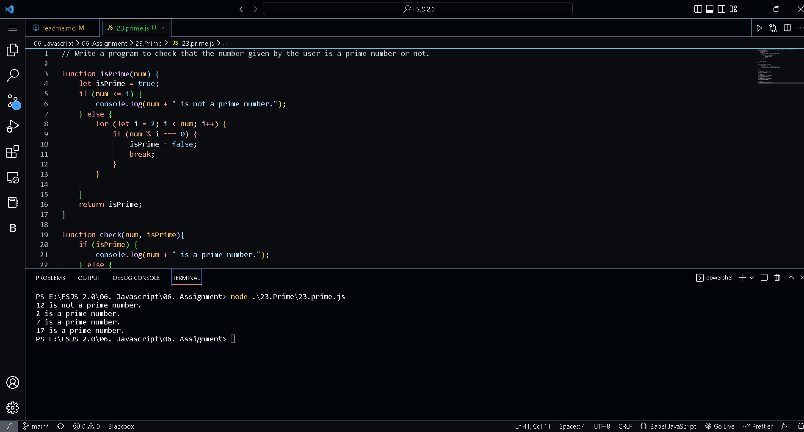
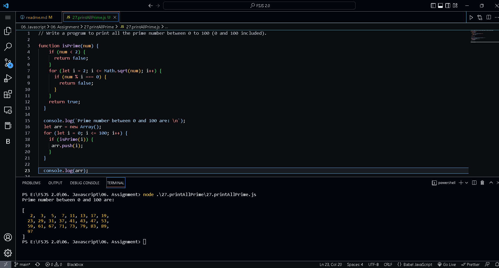

## Javascript -> <em>06. Assignment</em> 

# Table of Contents
- [Table of Contents](#table-of-contents)
  - [1. Variables](#1-variables)
  - [2. personalInfo using function](#2-personalinfo-using-function)
  - [3. upperCase function](#3-uppercase-function)
  - [4. includes function](#4-includes-function)
  - [5. split function](#5-split-function)
  - [6. split function part-2](#6-split-function-part-2)
  - [7. lastIndexOf function](#7-lastindexof-function)
  - [8. trail function](#8-trail-function)
  - [9. Boolean value](#9-boolean-value)
  - [10. Boolean checking values](#10-boolean-checking-values)
  - [11. Date and Time function](#11-date-and-time-function)
  - [12. Date and Time function part-2](#12-date-and-time-function-part-2)
  - [13. prompt function](#13-prompt-function)
  - [14. checking Even odd](#14-checking-even-odd)
  - [15. Finding Grade](#15-finding-grade)
  - [16. Check Season](#16-check-season)
  - [17. Check Month Days](#17-check-month-days)
  - [18. Check Month Days part-2](#18-check-month-days-part-2)
  - [19. File Access](#19-file-access)
  - [20. Array of Shopping Cart](#20-array-of-shopping-cart)
  - [21. Adding To Array List](#21-adding-to-array-list)
  - [22. Student Array](#22-student-array)
  - [23. checking Prime](#23-checking-prime)
  - [24. Even Odd](#24-even-odd)
  - [25. Body Mass Index](#25-body-mass-index)
  - [26. Printing Multiplication Table](#26-printing-multiplication-table)
  - [27. Print All Prime](#27-print-all-prime)
  - [28. Pattern](#28-pattern)
  - [29. File Extension](#29-file-extension)
  - [30. Simple Calculator](#30-simple-calculator)

## 1. Variables

Declaring variables and assign string, boolean, undefined and null data types, Display all the value with their data type.

## 2. personalInfo using function

Declaring variables to store first name, last name, marital status, country and age and display them using interploation method.

## 3. upperCase function

Declaring a varibale and assign string value to it and change all the string characters to capital letters using toUpperCase() method.

## 4. includes function

Declaring a varibale and assign string value to it and check if the string contains a word Script using includes() method

## 5. split function

Declaring a varibale and assign string value to it and then split it into an array using split() method

## 6. split function part-2

'Facebook, Google, Microsoft, Apple, IBM, Oracle, Amazon' split the string at the comma and change it to an array.

## 7. lastIndexOf function

Declaring an array containing the multiple values and using lastIndexOf to determine the position of the first and last occurrence of a word "pw skills".

## 8. trail function

Demonstrating the use of trim() to remove any trailing whitespace at the beginning and the end of a string.

## 9. Boolean value

Boolean value is either true or false.
  - Write three JavaScript statement example which provide truthy value.
  - Write three JavaScript statement example which provide falsy value.

## 10. Boolean checking values

Figure out the result of the following comparison expression first without using console.log(). After you decide the result confirm it using console.log()

## 11. Date and Time function

Use the Date object to find the date, month, date, day, hour, minutes, seconds.

## 12. Date and Time function part-2

Create a human readable time format using the Date time object.

## 13. prompt function

Get user input using prompt(“Enter your age:”). If user is 18 or older , give feedback:'You are old enough to drive' but if not 18 give another feedback stating to wait for the number of years he needs to turn 18.

## 14. checking Even odd

Checking, if a number is even or not using JavaScript Creating a program which checks that the given number is even or odd.

## 15. Finding Grade

Program to find grades of students according to their scores

## 16. Check Season

Check if the season is Autumn, Winter, Spring or Summer. Based on user input.

## 17. Check Month Days

Program to find the number of days in a month.

## 18. Check Month Days part-2

Program to find the number of days in a month, considering leap year.

## 19. File Access

Creating a countries.js file and store the countries name into this file, create a file web_techs.js and store the popular web technology names into this file. Accessing both file in a third file named main.js

## 20. Array of Shopping Cart

In the following shopping cart add, remove, edit items

## 21. Adding To Array List

In countries array checking if 'Ethiopia' exists in the array if it exists print 'ETHIOPIA'. If it does not exist add to the countries list.

## 22. Student Array

In array of 10 students ages: Sort the array and find the min and max age, Find the median age, Find the average age, Find the range of the ages, Compare the value of (min - average) and (max - average), use abs() method

## 23. checking Prime 

Program to check that the number given by the user is a prime number or not.

## 24. Even Odd 

Program to create two array "even" and "odd" having even and odd number between the 0 to 100 (0 and 100 included).

## 25. Body Mass Index 

Body mass index(BMI) is calculated.

## 26. Printing Multiplication Table 

Program to print the table of any number given by the user.

## 27. Print All Prime

Program to print all the prime number between 0 to 100 (0 and 100 included).

## 28. Pattern

Program to print the patterns using the loops.

## 29. File Extension

Javascript program which takes the input of filename as string and prints the extension of the file in the console.

## 30. Simple Calculator

Simple calculator program in JavaScript which can perform the addition, substraction, multiplication and division on given numbers.

