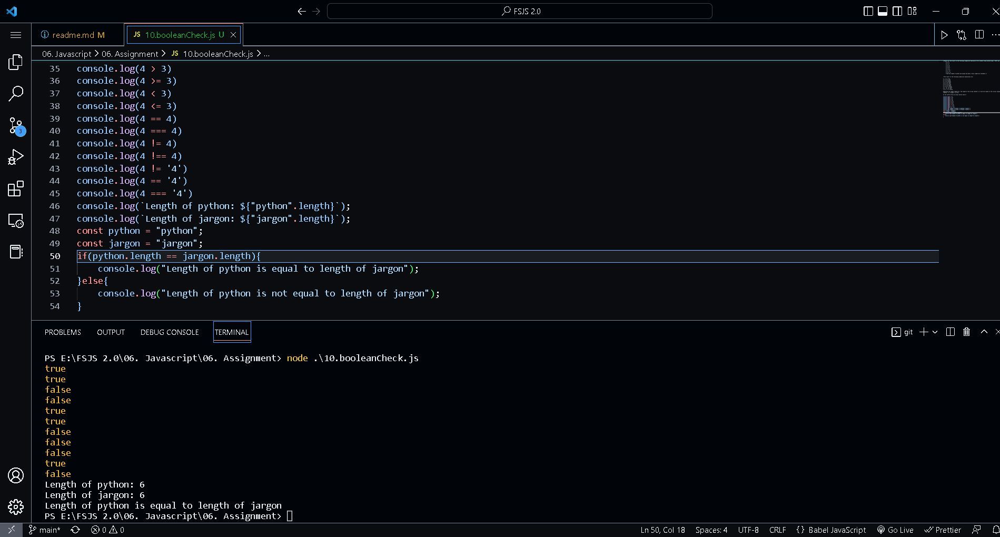

## Javascript -> <em>06. Assignment</em> 

# Table of Contents
- [Table of Contents](#table-of-contents)
  - [1. Variables](#1-variables)
  - [2. personalInfo using function](#2-personalinfo-using-function)
  - [3. upperCase function](#3-uppercase-function)
  - [4. includes function](#4-includes-function)
  - [5. split function](#5-split-function)
  - [6. split function part-2](#6-split-function-part-2)
  - [7. lastIndexOf function](#7-lastindexof-function)
  - [8. trail function](#8-trail-function)
  - [9. Boolean value](#9-boolean-value)
  - [10. Boolean checking values](#10-boolean-checking-values)
  - [11. Date and Time function](#11-date-and-time-function)
  - [12. Date and Time function part-2](#12-date-and-time-function-part-2)

## 1. Variables

Declaring variables and assign string, boolean, undefined and null data types, Display all the value with their data type.

## 2. personalInfo using function

Declaring variables to store first name, last name, marital status, country and age and display them using interploation method.

## 3. upperCase function

Declaring a varibale and assign string value to it and change all the string characters to capital letters using toUpperCase() method.

## 4. includes function

Declaring a varibale and assign string value to it and check if the string contains a word Script using includes() method

## 5. split function

Declaring a varibale and assign string value to it and then split it into an array using split() method

## 6. split function part-2

'Facebook, Google, Microsoft, Apple, IBM, Oracle, Amazon' split the string at the comma and change it to an array.

## 7. lastIndexOf function

Declaring an array containing the multiple values and using lastIndexOf to determine the position of the first and last occurrence of a word "pw skills".

## 8. trail function

Demonstrating the use of trim() to remove any trailing whitespace at the beginning and the end of a string.

## 9. Boolean value

Boolean value is either true or false.
  - Write three JavaScript statement example which provide truthy value.
  - Write three JavaScript statement example which provide falsy value.

## 10. Boolean checking values

Figure out the result of the following comparison expression first without using console.log(). After you decide the result confirm it using console.log()

## 11. Date and Time function

Use the Date object to find the date, month, date, day, hour, minutes, seconds.

## 12. Date and Time function part-2

Create a human readable time format using the Date time object.

