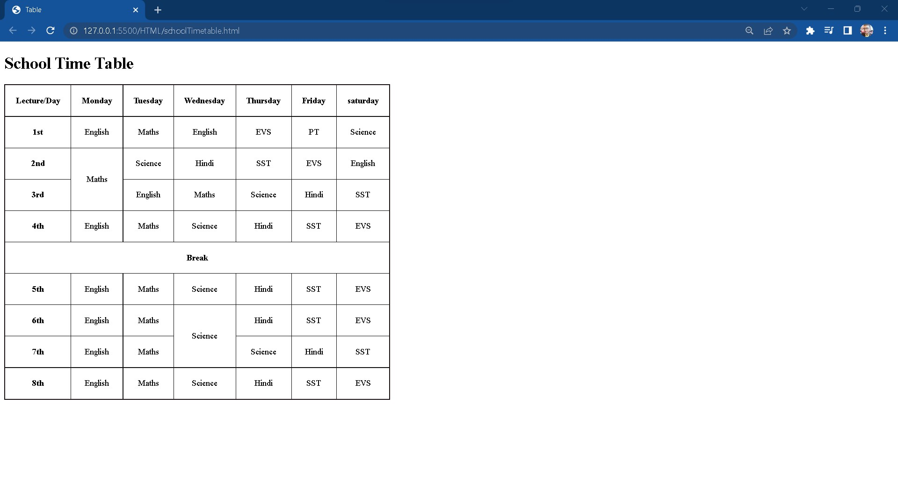
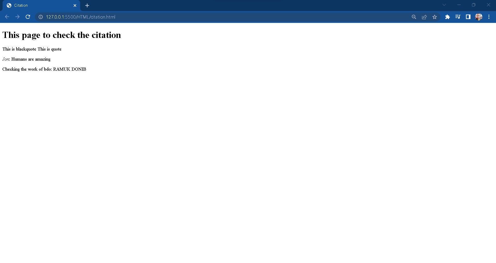
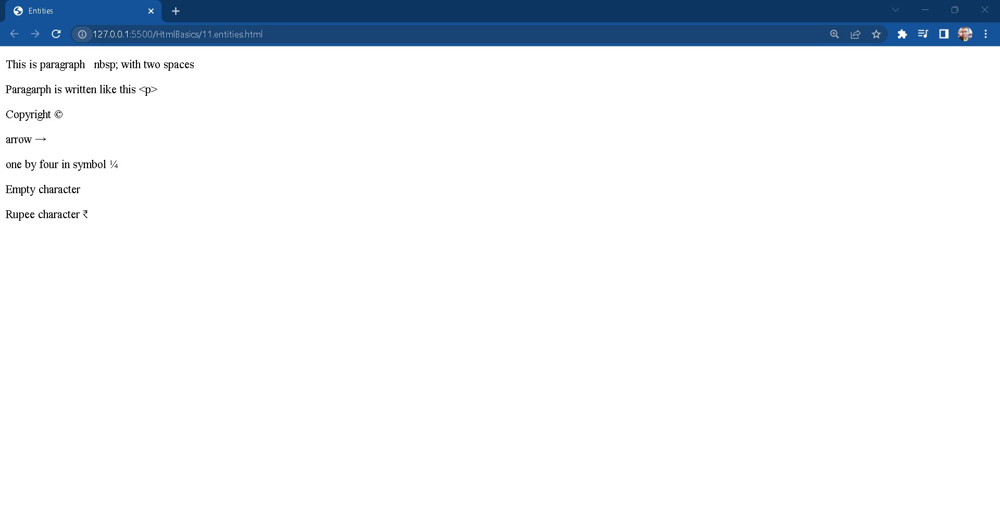

# Table of Contents
1. [Heading Tags](#heading)
2. [Paragrahp Tags](#paragraph)
3. [Image and anchor Tags](#image)
4. [List Tags](#list)
5. [Table Tags making School Time Table](#table)
6. [Form Tags](#form)
7. [Formatting Tags](#formatting)
8. [Citation Tags](#citation)
9. [Classes and Id attributes](#classes)
10. [Inline and Block elements](#inline)
11. [Entities](#entities)
12. [iframe](#iframe)
12. [Audio and Video](#audio)

### 1. Heading Tags

### 2. Paragraph Tags

### 3. Image and anchor Tags

### 4. List Tags

### 5. Table Tags making school timetable

### 6. Form Tags

### 7. Formatting Tags

### 8. Citation Tags

### 9. Classes and Id attributes

### 10. Inline and block elements

### 11. Entities

### 12. iframe

### 13. Audio and Video

