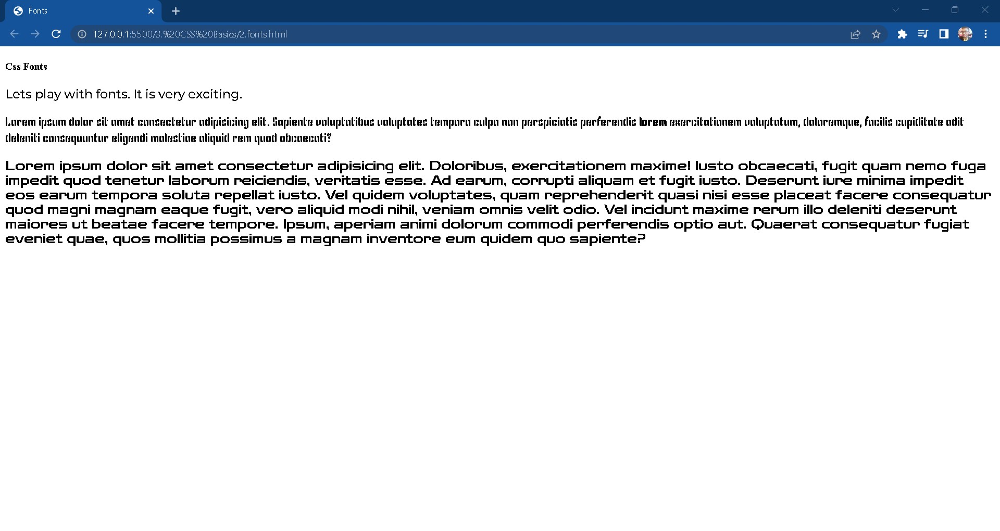
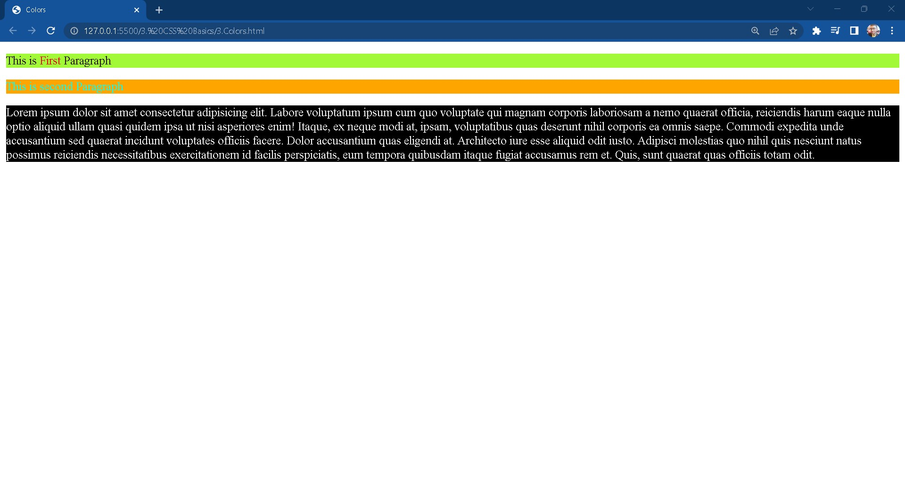
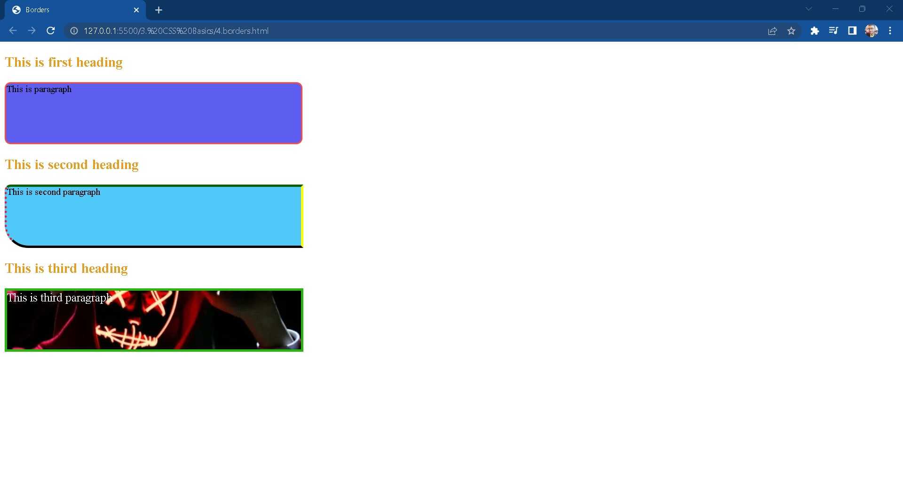
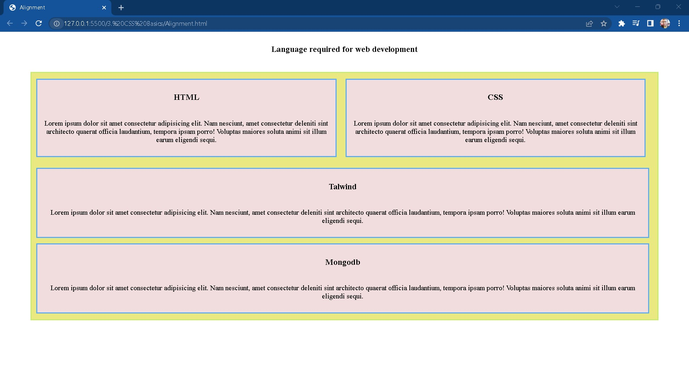
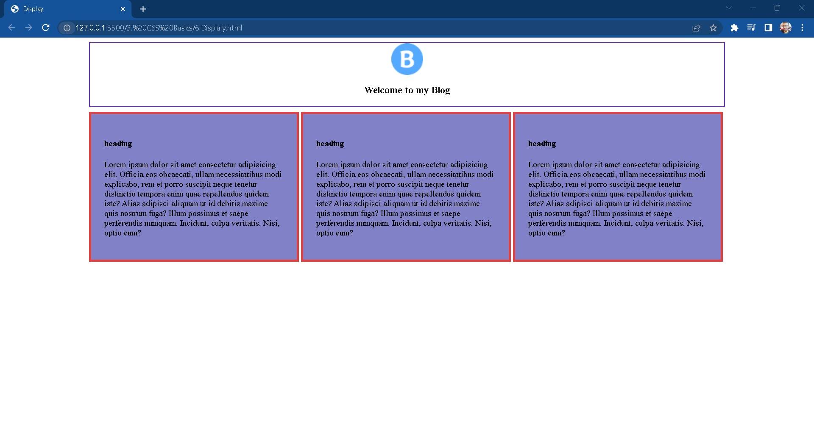
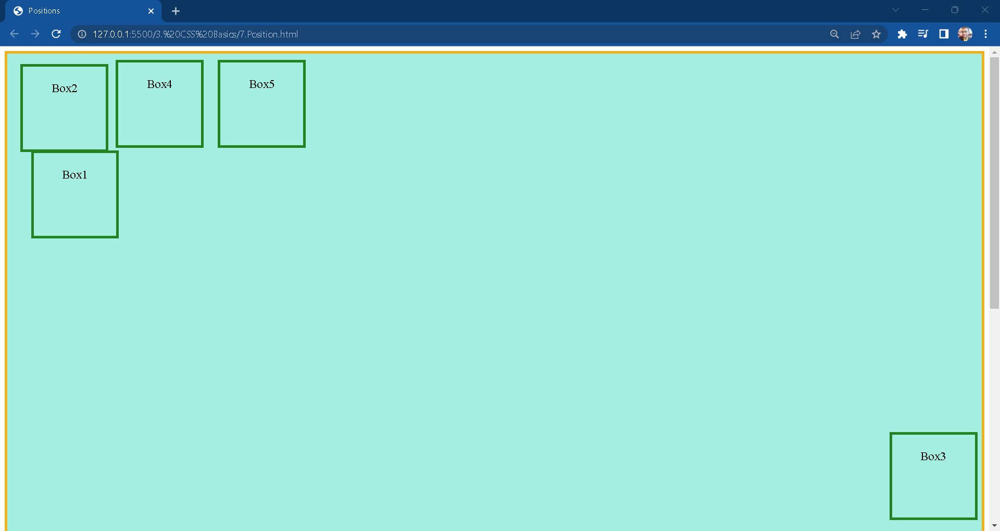
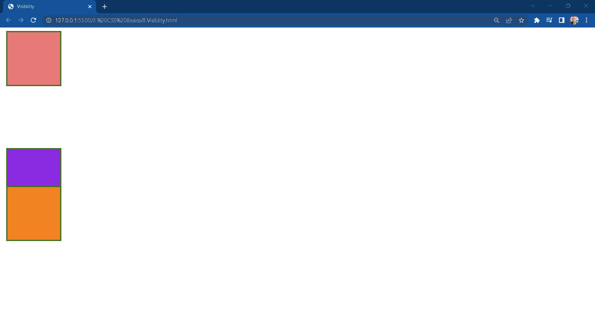
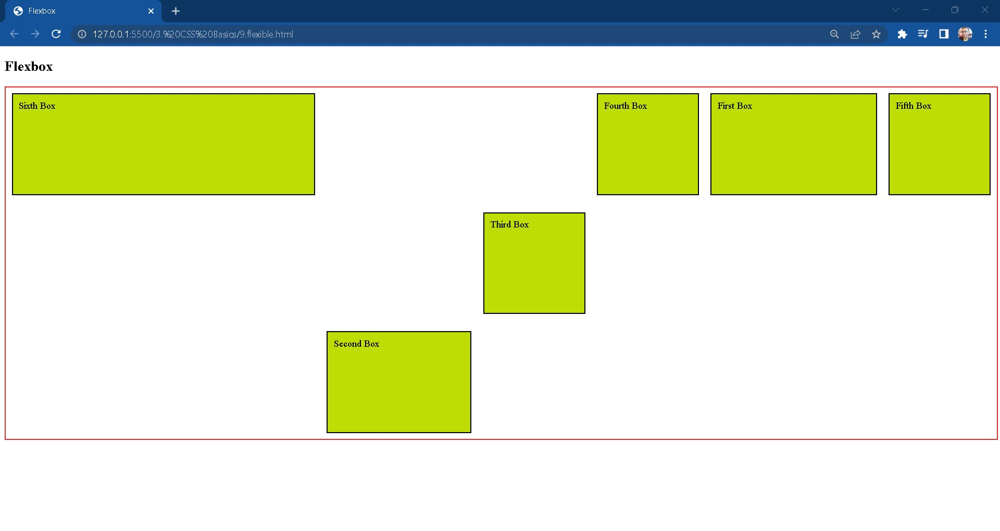

# Table of Contents
1. [Padding And Margin](#padding)
2. [Fonts](#fonts)
3. [Colors](#colors)
4. [Borders And Background](#borders)
5. [Float, clear and Alignment](#float)
6. [Display Properties](#display)
7. [Positions](#positions)
8. [Visibility and z-index](#visibility)
9. [Flexbox](#flexbox)

## 1. Padding And Margin

Padding is the space between an element's border and the element's content while margin is the space around an element's border. 

## 2. Fonts

To change our text with different fonts we will use font-family. We can use our desired font family by importing google fonts in html file or in css file.

## 3. Colors

Color property is used to set the color to our text, background or any other html elements. We can use several different ways to specify the colors like: color keywords, rgb, rgba, hex values, etc.

## 4. Borders And Background

Border helps us to define border to particular html element.

## 5. Float, clear and Alignment

Float specifies how an element should float whereas clear property specifies what elements can float beside the cleared element and on which side. 
The text-align property in CSS is used to specify the horizontal alignment of text in an element ie., it is used to set the alignment of the content horizontally, inside a block element or table-cell box.

## 6. Display Properties

The display property specifies how an element is displayed.

Every HTML element has a default display value depending on what type of element it is. The default display value for most elements is block or inline.

## 7. Positions

The position property specifies the type of positioning method used for an element.

There are five different position values:
i.   static
ii.  relative
iii. absolute
iv.  fixed
v.   sticky

Elements are then positioned using the top, bottom, left, and right properties. However, these properties will not work unless the position property is set first. They also work differently depending on the position value.

## 8. Visibility and z-index

The visibility property specifies whether or not an element is visible. Visbility hides the element but will show its empty space whereas Display: none hides the element and the space.z-index will work only for position: relative, absolute, fixed or sticky. z-index does not work on static position. With the help of z-index we can specify the preference of one element over the other element.  

## 9. Flexbox

Flexbox is a one-dimensional layout method for laying out items in rows or columns. Css flexbox is a better way to align items into a container.
(Flexbox = flexible + box)

Flex properties on flex container:
1. **flex-driection**: row, column, row-reverse, column-reverse (by default row).
2. **flex-wrap**: wrap, no-wrap, wrap-reverse (by default no wrap),
wrapping the items in the container.
3. **flex-flow**: short hand of flex-direction and flex-wrap.
4. **justify-content: center, space-between, space-evenly, space-around,
it will justify the elements in horizontal direction.
5. **align-items**: center, flex-end, flex-start, center,
it will justify content in vertical direction.

Flex properties on flex items:
1. **order**: higher the order later it shows up in the container.
2. **flex-grow: specifies how much the item will grow relative to the rest of the flexible items inside the same container.
3. **flex-shrink**: specifies how much the item will shrink relative to the rest of the flexible items inside the same container.
4. **flex-basis**: when flex-direction is set to row flex basis will control the width and if the flex-direction is column it will control height.
5. **align-self**: flex-end, flex-start, center,
align the particular element in vertical direction.
6. **flex**: short-hand of flex-grow flex-shrink and flex-basis.

