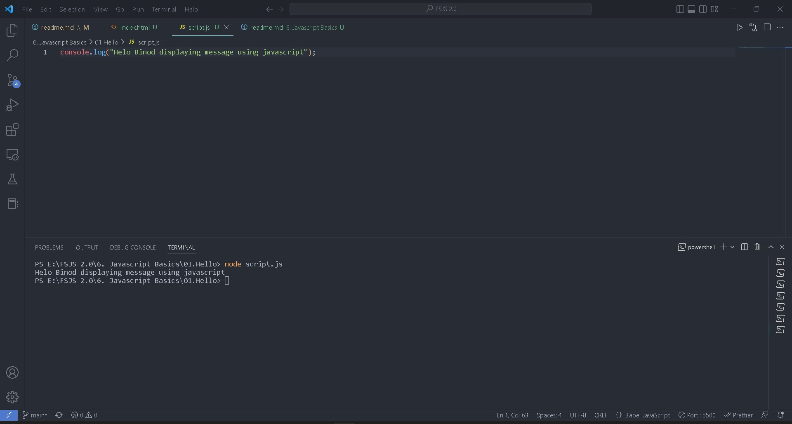
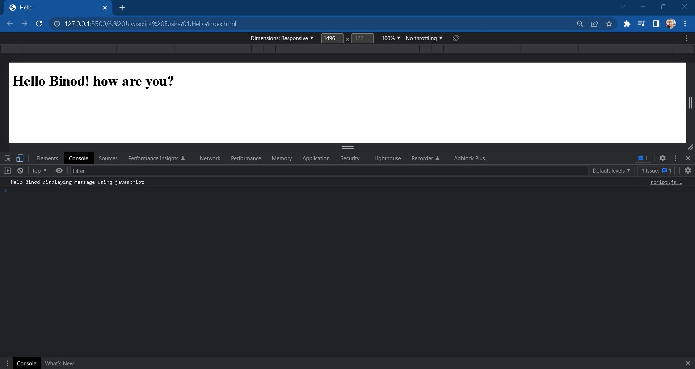
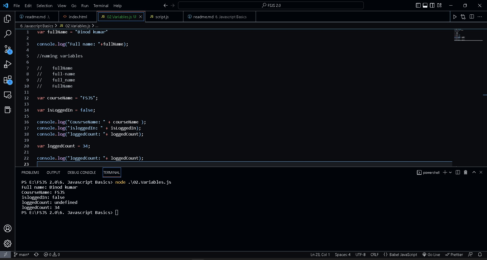
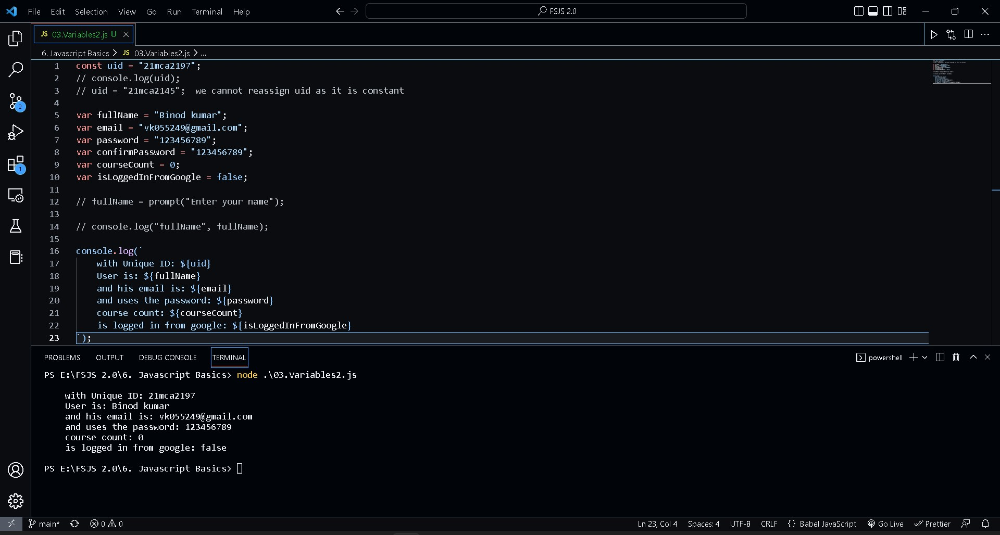
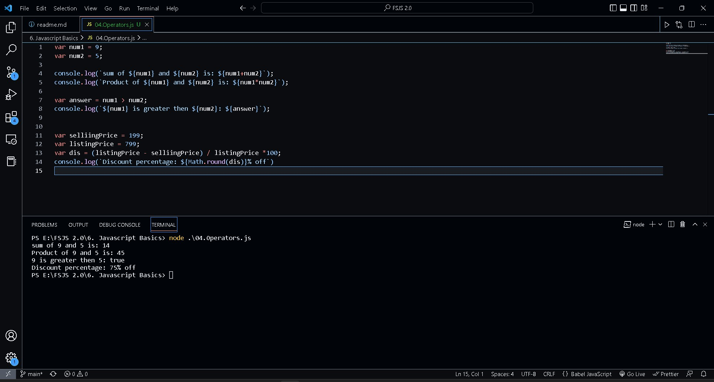

## Javascript Basics 

# Table of Contents
- [Table of Contents](#table-of-contents)
  - [1. Hello World program](#1-hello-world-program)
  - [2. Variables](#2-variables)
  - [3. Operators](#3-operators)

## 1. Hello World program

Running the javascript file through node js from vs code terminal.

We can see the console output from web browser in the console developer. 

## 2. Variables

We can reserve some memory using var, let and const keyword. and using console.log() command we can view our output in terminal.

using const keyword and different way to print multiple variables using single console log command.

## 3. Operators

In JavaScript, an operator is a special symbol used to perform operations on operands (values and variables). 

